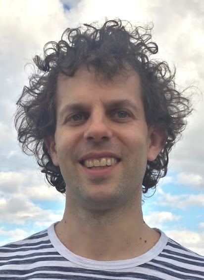
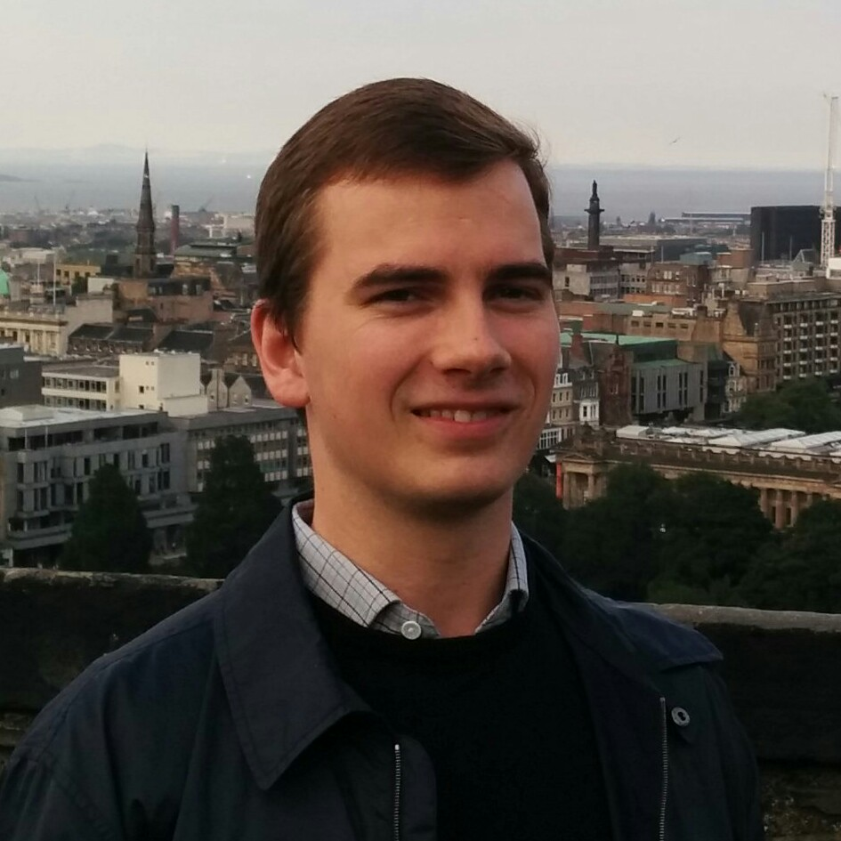
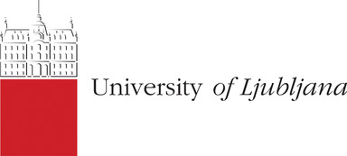
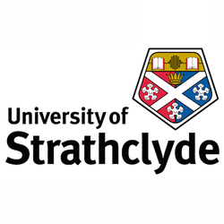

## Effect Handler Oriented Programming

Effect handlers allow programmers to define, customise, and compose a
range of crucial programming features ranging from concurrency to
probability, inside the programming language. EHOP will develop a
radical new programming paradigm called Effect Handler Oriented
Programming (or EHOP for short). EHOP will empower software developers
to build modular interactive software, enabling the development of
safe, secure, and reliable applications. As well as developing the
theory and practice of effect handler oriented programming, EHOP will
add effect handlers to systems as diverse as WebAssembly, the new
target language for the web, and Hack, the language in which the
Facebook app is written.

EHOP is led by Sam Lindley, a Reader in Programming Language Design
and Implementation at The University of Edinburgh and is funded by a
£1.45M [UKRI Future Leaders
Fellowship](https://www.ukri.org/our-work/developing-people-and-skills/future-leaders-fellowships/)
(MR/T043830/1) between February 2021 and January 2025.

### People

Core team

*  <a href="https://homepages.inf.ed.ac.uk/slindley">Sam Lindley</a> (Principal Investigator)
*  <a href="https://www.dhil.net/">Daniel Hillerström</a> (Researcher)

Project partners

* <a href="https://bentnib.org/">Robert Atkey</a> (Strathclyde)
* <a href="https://nickbenton.name/">Nick Benton</a> (Facebook)
* <a href="https://www.microsoft.com/en-us/research/people/daan/">Daan Leijen</a> (Microsoft)
* <a href="https://web.archive.org/web/20150926114227/http://research.microsoft.com/en-us/um/people/akenn/">Andrew Kennedy</a> (Facebook)
* <a href="https://www.c2d3.cam.ac.uk/directory/521/dr-anil-madhavapeddy">Anil Madhavapeddy</a> (Cambridge)
* <a href="https://personal.cis.strath.ac.uk/conor.mcbride/">Conor McBride</a> (Strathclyde)
* <a href="https://matija.pretnar.info/">Matija Pretnar</a> (Ljubljana)
* <a href="https://people.mpi-sws.org/~rossberg/">Andreas Rossberg</a> (DFINITY)
* <a href="https://kcsrk.info/">KC Sivamarakrishnan</a> (IIT Madras)
* <a href="https://www.lpw25.net/">Leo White</a> (Jane Street)

Visiting researcher

* <a href="https://homepage.cs.uiowa.edu/~jgmorrs/">J. Garrett Morris</a> (Iowa)

  <!-- 
 -->
  <!-- <a href="https://homepages.inf.ed.ac.uk/slindley">Sam Lindley</a>&nbsp;(Principal Investigator) -->
  <!--  -->
  <!-- 
 -->

  <!-- 
 -->
  <!-- <a href="https://www.dhil.net/">Daniel Hillerström</a>&nbsp;(Researcher) -->
  <!--  -->
  <!-- 
 -->

### Project partners

  
  
  

  
  <!--  -->
  

  
  
  

<!-- ### Events -->

